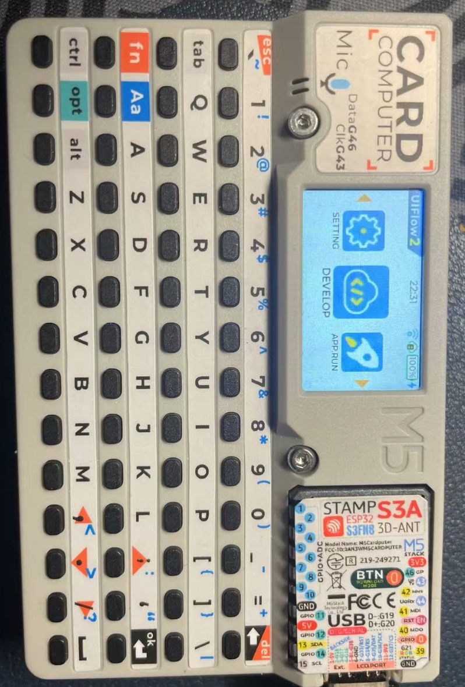
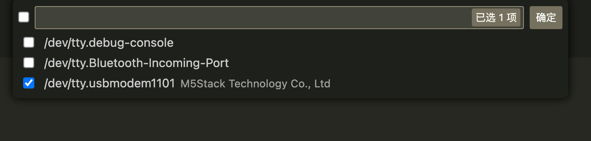
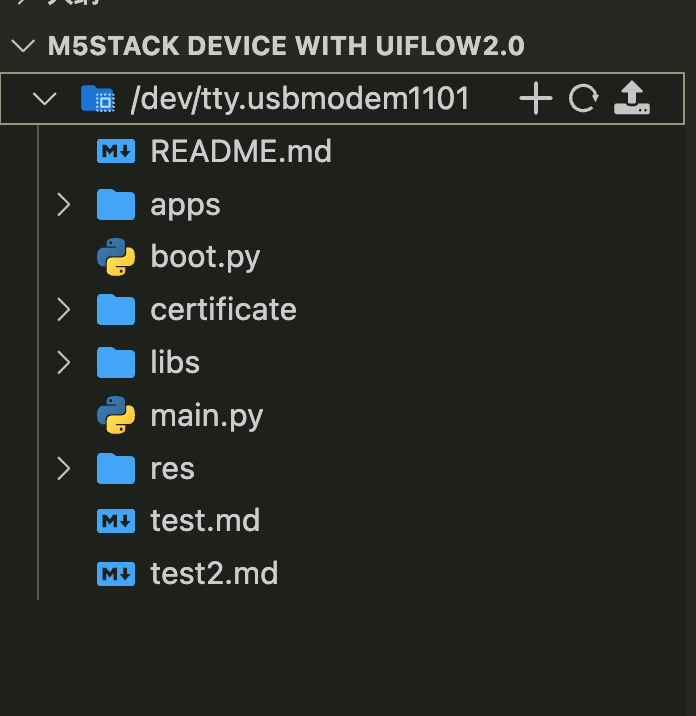
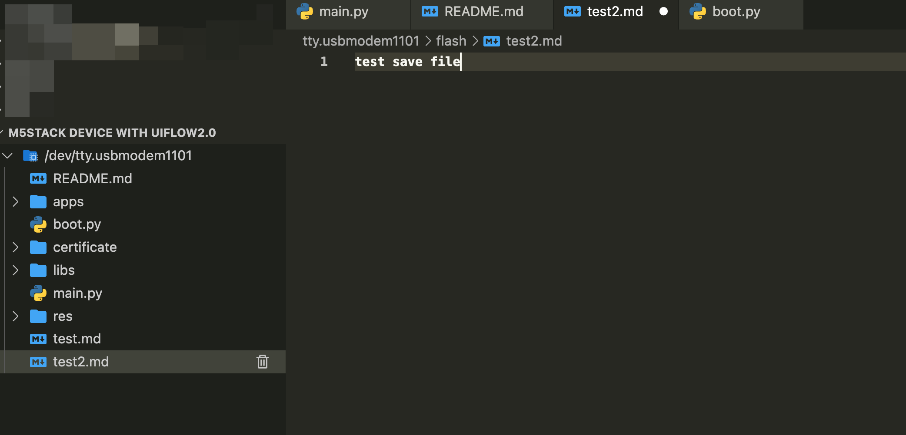

# **vscode-m5stack-mpy-uiflow2**


# vscode-m5stack-mpy

A extension for M5Stack Micropython system.

## Features

- Write/Read files in M5Stack Device

## Quick Start

- Install vscode-m5stack-mpy.
- Connection M5Stack Device with USB cable.



- Click "Add M5Stack with microPython" and select the correct serial port of M5Stack status bar.




- Open M5Stack file tree. If Device resets, please click the refresh button to reopen the file tree.


- Editor a file.


- Save file. You can press `ctrl + s` or click `File->Save` to save file.

## TBD
- Auto Completion of Units and Modules.
- Display tips when hover on it.
- Syntax-highlighting
- Auto Completion
- Debugging
- Delete files in M5Stack Device
- Execute command in M5Stack Device
- Recovery running status of M5Stack Device


## Contributions

To verify changes of this plugin you build the plugin with

```
git clean -fdX
yarn cache clean
yarn
```

Then you start vscode with this directory as argument like this

```
code ./
```

Then you hit F5 and verify that it works.
See more on https://code.visualstudio.com/api

